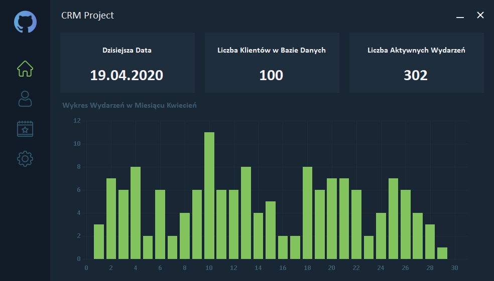

# CRM Project
Project made for exercises on object programming at the WSB in Warsaw.  The application was created in C # and the .NET Framework.

##First launch
- Before starting the application for the first time, create a new database (the application uses the MySQL database). Recommended character encoding is `utf8_general_ci`
- After running the application, we must (it is located in the CRM Project\bin\Debug) to configure it by entering the data of the previously created database. Ades, username, password and database name.
- After correct configuration, the program will automatically create the tables needed for its work. The database, however, will be empty. If you want, you can import the database supplemented with sample data, it is located in  `CRM Project\bin\Debug\crm-project.sql`

##License
[MIT](https://choosealicense.com/licenses/mit/ "MIT")